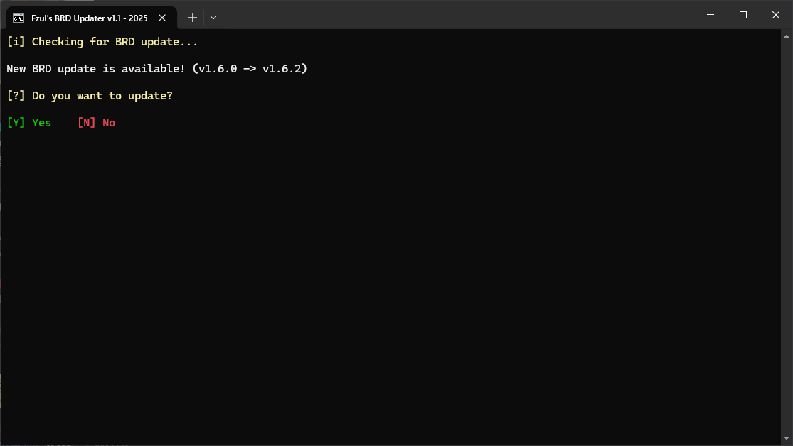

# Fzul's BRD Updater Script

A companion batch script to be used with BetterRenderDragon. 

## ✨ Features
* **Fully portable**  
Configurations are stored in the script itself. (a bit experimental)

* **Futureproof (hopefully)**  
It has options to change source GitHub link, file to download, and executable to open. Means you can adjust for future changes by yourself.  
Note: Default values are set to work with [QYCottage's BetterRenderDragon v1.6.0+](https://github.com/QYCottage/BetterRenderDragon/)

* **Automatically updates BRD and opens it**  
It checks for updates and asks you to update if there is any, then it opens BRD.

* **Adds folder to Windows Defender exclusions (optional)**  
So, BRD files will not be deleted without notice.

* **Zero user interaction required (optional)**  
After completing initial setup, you can set it to update automatically without any confirmation from its settings.  

* **Settings**   
You can change updater settings from the script itself or edit the script (settings are in the last of the script)

## 💁‍♂️ How to use?
> ![NOTE]
> * The script can work with existing BRD installation or it can get fresh BRD files for you.
> * Actions are labeled with the key to press. You navigate within the script by pressing keys on keyboard.

 

[**📥 Download Fzul's BRD Updater script**](https://github.com/faizul726/brd-updater-script/download/releases/latest/brd_update_and_run.bat) 

1. Download and put the script in a folder where you want to have BRD or already have.

2. Double click to open the script.

3. It will check whether current folder is writeable. If it's not, you will have to exclude the folder from ransomware protection or whatever that restricts writing to it.

4. It will ask you to add the current folder to Windows Defender exclusion, after confirming it will automatically add it after you grant admin permission.  
**Make sure to do it or BRD files may get deleted without notice. If you use other antivirus then you have to do it manually**

5. It will ask for BRD version Major, Minor, Patch. It's the version number.  
For example: in case of BRD v1.6.2, you would enter 1, 6, 2 for the questions respectively.  
If you already have BRD in the folder then enter its version.  
If you want it to download BRD newly for you then enter 0, 0, 0 or any version lower than the latest.  
Note: This version number technically doesn't matter. The script uses it to compare with the latest version available on GitHub.

6. It will ask you to confirm the following details:  
    * `GitHub repo link`: GitHub link from where it will download.
    * `Target file name`: File to download from GitHub releases.
    * `Executable file name`: File which opens Minecraft with BRD.  

    I have set default values of those to work with [QYCottage's BetterRenderDragon v1.6.0+](https://github.com/QYCottage/BetterRenderDragon/)  
    So, you can confirm all those without manually changing anything. Still make sure the details are correct or it will not work as expected.

7. After confirming all these details, it will store details in the script.  
Make sure your PC doesn't crash or turn off as it may make the script corrupted.  
Storing details should not take more than 5 seconds.

8. After this initial setup, you don't have to do it again. It will check for updates everytime it's opened and will ask you to update if there is any. Then it will open BRD.  
**That means you can create a shortcut to the script and use it as your way to both update and open BRD.**  

> ![TIP]  
> * You can disable update confirmation from updater settings, so it updates and opens BRD without any user confirmation.  
> * You can open updater settings once the initial setup is complete, during the 3 second wait window by pressing S.
> * You can also change other details that you gave in the initial setup.